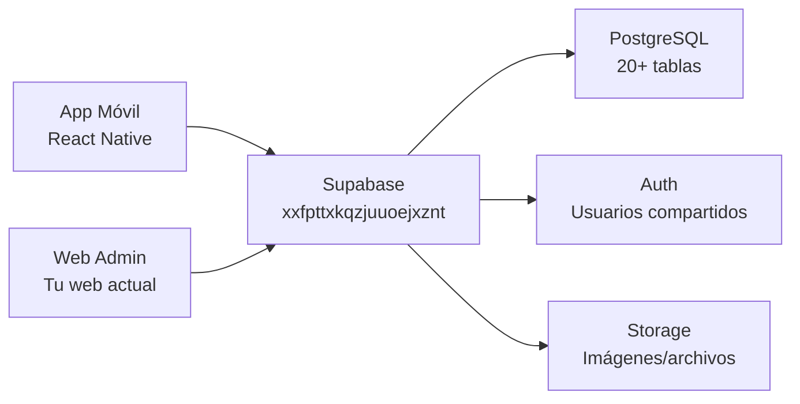

# Análisis Completo: Conexión BD ↔ Web Admin

## Resumen Ejecutivo

Tu proyecto **Kaelo** ya tiene una infraestructura sólida con Supabase. La conexión de la BD a tu web admin es **100% posible** y además ya tienes la mayoría del trabajo pesado hecho. A continuación respondo cada pregunta basándome en el análisis del código fuente.

---

## 1. ¿Ya tienes un proyecto de Supabase creado?

### ✅ SÍ — Todo listo

| Dato | Valor |
|------|-------|
| **URL** | `https://xxfpttxkqzjuuoejxznt.supabase.co` |
| **Anon Key** | `sb_publishable_EU62AZV...` (presente en `.env`) |
| **Cliente configurado** | [supabase.ts](file:///c:/Users/jonat/Documents/kaelo-expo/src/lib/supabase.ts) |
| **Validación de env** | [env.ts](file:///c:/Users/jonat/Documents/kaelo-expo/src/config/env.ts) con Zod |

> [!IMPORTANT]
> Tu web admin necesita usar **exactamente la misma URL y anon key** para conectarse a la **misma base de datos**. Solo cambia la librería cliente (en vez de React Native usarás `@supabase/supabase-js` directamente para web).

---

## 2. ¿Ya tienes las tablas creadas en Supabase?

### ✅ SÍ — Schema completo con 20+ tablas

Las tablas ya existen en tu Supabase. Lo confirma el archivo [database.types.ts](file:///c:/Users/jonat/Documents/kaelo-expo/database.types.ts) (90KB, auto-generado por `supabase gen types`), que contiene tipos TypeScript para cada tabla.

### Tablas existentes confirmadas:

| Categoría | Tablas |
|-----------|--------|
| **Usuarios** | `profiles` |
| **Rutas** | `routes`, `route_waypoints`, `route_businesses`, `route_completions`, `route_purchases`, `saved_routes` |
| **Negocios** | `businesses`, `products` |
| **Pedidos** | `orders`, `order_items` |
| **Reseñas** | `reviews` |
| **Notificaciones** | `notifications` |
| **Gamificación** | `user_achievements`, `user_goals`, `user_personal_records`, `user_stats_monthly` |
| **Cupones** | `business_coupons`, `unlocked_coupons`, `sponsored_segments` |

> [!NOTE]
> Las migraciones SQL están en [migrations/reference/](file:///c:/Users/jonat/Documents/kaelo-expo/migrations/reference/) — 18 archivos que definen todo el schema, incluyendo extensiones PostGIS, índices, RLS, y funciones. **NO necesitas crear las tablas desde cero.**

---

## 3. ¿Tu app móvil ya está conectada a Supabase? ¿Tiene datos reales?

### ⚠️ PARCIALMENTE — Conectada pero con funcionalidad limitada

**Lo que SÍ funciona:**
- ✅ Cliente Supabase configurado con tipos TypeScript completos
- ✅ Feature de **rutas** implementada con query real a Supabase:
  ```typescript
  // src/features/routes/api.ts
  const { data } = await supabase
    .from("routes")
    .select("*")
    .order("created_at", { ascending: false });
  ```
- ✅ Hook `useRoutes` con TanStack Query para caching

**Lo que NO está implementado aún:**
- ❌ **Autenticación** — Las pantallas de login y registro son **placeholders** (solo muestran *"Pantalla de login (en desarrollo)"*)
- ❌ No hay llamadas a `supabase.auth.*` en el código fuente
- ❌ No hay manejo de sesión real en la app

### Sobre datos reales existentes:
> [!WARNING]
> No puedo verificar datos reales en la BD desde aquí (solo veo el código, no la BD). **Necesitas revisar directamente en el dashboard de Supabase** (`https://supabase.com/dashboard/project/xxfpttxkqzjuuoejxznt`) para ver si hay rutas, usuarios o negocios reales. La app móvil está preparada para leer rutas pero sin auth funcional, es probable que los datos sean limitados o de prueba.

---

## 4. ¿Qué datos ya existen en tu BD?

### 🔍 Necesita verificación manual

Desde el código puedo inferir:
- **Rutas**: Es probable que existan algunas (hay API funcional para leerlas)
- **Perfiles**: Si no hay auth funcional, probablemente solo hay datos de prueba
- **Negocios**: No encontré API de negocios implementada, así que probablemente aún no hay datos
- **Órdenes/Reviews**: No implementados → probablemente vacíos

**Acción recomendada**: Ve al [Dashboard de Supabase → Table Editor](https://supabase.com/dashboard/project/xxfpttxkqzjuuoejxznt/editor) y revisa qué tablas tienen datos.

---

## 5. ¿Qué roles debe servir primero esta web?

### 📋 Recomendación basada en la arquitectura

Tu schema ya define roles a través de campos en `profiles`:

```sql
is_creator BOOLEAN DEFAULT FALSE,
is_business_owner BOOLEAN DEFAULT FALSE,
```

Y funciones de seguridad en la BD:
- `is_admin(user_id)` — verifica si `user_type = 'admin'`
- `is_business_owner(user_id, business_id)` — verifica ownership
- `is_route_creator(user_id, route_id)` — verifica autoría

### Prioridad sugerida:

| Prioridad | Rol | Justificación |
|-----------|-----|---------------|
| 🥇 **1ero** | **Admin** | Control total: ver/moderar rutas, negocios, usuarios. Sin esto no puedes gestionar nada |
| 🥈 **2do** | **Comercio** | Los negocios necesitan dashboard para gestionar productos, pedidos, horarios |
| 🥉 **3ero** | **Creador** | Los creadores ya tienen la app móvil; la web sería complementaria |

---

## 6. ¿La autenticación web debe compartir usuarios con la app móvil?

### ✅ SÍ — Es la misma BD, mismas credenciales

Al usar la **misma URL y anon key** de Supabase, la web y la app comparten:
- ✅ **Misma tabla `auth.users`** de Supabase Auth
- ✅ **Misma tabla `profiles`** para datos extendidos
- ✅ **Mismo sistema de JWT tokens**

**Cómo funciona en la práctica:**
1. Un usuario se registra en la app móvil → se crea en `auth.users` + `profiles`
2. Ese mismo usuario hace login en la web con el **mismo email/contraseña** → funciona automáticamente
3. Las sesiones son independientes (la app tiene su token, la web otro), pero los datos son los mismos

> [!TIP]
> Para la web admin, puedes usar `supabase.auth.signInWithPassword()` directamente. No necesitas configuración adicional. El cliente web de Supabase maneja la persistencia de sesión con `localStorage` en lugar de `AsyncStorage`.

---

## 7. ¿Tienes RLS (Row Level Security) ya configurado?

### ⚠️ PARCIALMENTE — RLS habilitado, pero sin policies completas

**Lo que SÍ está hecho:**
- ✅ RLS **habilitado** en **TODAS** las tablas públicas (migration [20260128000016](file:///c:/Users/jonat/Documents/kaelo-expo/migrations/reference/20260128000016_enable_rls.sql))
- ✅ Permisos GRANT configurados para `authenticated` y `anon`
- ✅ Funciones helper: `is_admin()`, `is_business_owner()`, `is_route_creator()`, `get_current_user_id()`
- ✅ Funciones SECURITY DEFINER para operaciones seguras

**Lo que FALTA:**
- ❌ **Las policies específicas NO están definidas** en el código
  - El archivo de migración termina con un comentario: *"Next step: Create RLS policies in separate migration files"*
  - No hay archivos de migración adicionales que definan las policies

> [!CAUTION]
> **Esto es crítico**: Con RLS habilitado pero SIN policies, **ningún usuario puede leer ni escribir datos** (excepto con service_role key). Esto explica por qué la app podría tener problemas para mostrar datos. Necesitamos crear las policies antes de conectar la web.

---

## Resumen: ¿Es posible conectar la BD a la web?

### ✅ SÍ, 100% posible — y la mayoría del trabajo ya está hecho



### Lo que necesitas para conectar:

| Paso | Qué hacer | Estado |
|------|----------|--------|
| 1 | Agregar `@supabase/supabase-js` a la web | 🔧 Por hacer |
| 2 | Configurar cliente con misma URL + anon key | 🔧 Por hacer |
| 3 | Implementar auth en la web (`signInWithPassword`) | 🔧 Por hacer |
| 4 | Crear RLS policies para controlar acceso por rol | ⚠️ **Crítico** |
| 5 | Queries a tablas (`profiles`, `routes`, `businesses`) | 🔧 Por hacer |
| 6 | Verificar datos existentes en la BD | 🔍 Manual |
